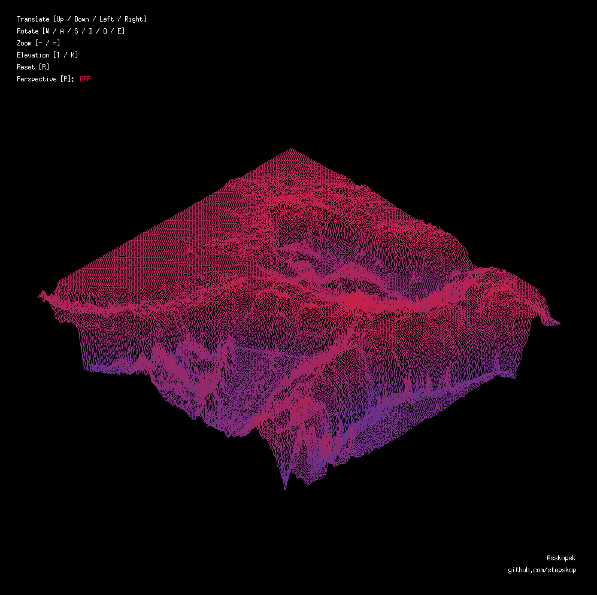

# Heatmap rasterizer in C
3D renderer of heatmaps written in C using X server API

<br>
## Build
Make shoul automatically pull submodules and build them
```bash
make
```
## Usage
Supply the binary with map to render
```bash
./fdf map.fdf
```
Example map:
```
0 0 0 0
0 5 5 0
0 5 5 0
0 0 0 0
```